# 大数据案例期末项目报告

**学生姓名：** 王倩  **学 号：** ______________  **得分：** ______________

**项目名称：** AI 避坑导购系统（AI-Powered Shopping Guide & Pit-Avoidance System）

**开发类型：** ☑ 全栈项目 （□ 网页端项目 □ 桌面应用 □ 移动端项目 □ 本地项目）

**完成时间：** 2026 年 6 月 6 日

**线上访问地址：** https://pit-avoidance-d3gx1xj3j622007d9-1438973051.tcloudbaseapp.com/used-check.html

**GitHub 仓库：** https://github.com/Luna-cy-source/Shopping-Guide-Pit-Avoidance-Website

---

## 项目工具、资源与附件清单

| 资源类别 | 实际使用内容 | 用途说明 |
|---|---|---|
| LLM 工具 | DeepSeek API (deepseek-chat) | 核心 AI 分析引擎：间接聚合京东/淘宝/天猫/拼多多/苏宁/抖音/小红书/B站/知乎/什么值得买等多平台评论，5 种 Intent 智能路由驱动单品检测/对比/选品/二手鉴定等，输出结构化 JSON 避坑方案报告 |
| IDE 开发工具 | CodeBuddy（VS Code + AI 辅助） | 项目编写、代码调试、文件管理、语法检测与项目运行 |
| 智能 Agent 工具 | CloudBase Agent | 辅助云函数代码生成、逻辑纠错、CloudBase 资源管理 |
| Github 仓库 | [github.com/Luna-cy-source/Shopping-Guide-Pit-Avoidance-Website](https://github.com/Luna-cy-source/Shopping-Guide-Pit-Avoidance-Website) | 项目版本管理、代码备份、迭代记录留存 |
| 自定义 Website | [pit-avoidance-d3gx1xj3j622007d9-1438973051.tcloudbaseapp.com](https://pit-avoidance-d3gx1xj3j622007d9-1438973051.tcloudbaseapp.com) | 项目线上公开访问地址 |
| 云服务商 | 腾讯云 CloudBase（NoSQL 数据库 + 云函数 + 静态托管） | 项目部署、数据存储、后端云函数（aiSearch + registerUser）、静态网站 CDN 加速 |
| 程序包附件 | 项目源码包、结课项目报告.md、.env.example | 完整可运行源码、配套说明文档、环境配置模板 |
| 补充说明 | 价格数据采用"实时抓取 + AI 估算"双源互补策略：优先慢慢买 API → 失败降级 DeepSeek 估算；评论数据采用"AI 知识库聚合"策略：借助 DeepSeek 训练数据中涵盖的多平台评论实现语义聚合；电商跳转通过京东联盟/淘宝客 API 实现佣金追踪 | |

---

## 摘要

本项目基于 Next.js 14 + React 18 + TypeScript + CloudBase 构建了一套完整的 AI 驱动消费决策辅助系统——AI 避坑导购系统。针对当前电商环境中"商品评价信息过载""智商税产品泛滥""跨平台比价耗时"三大核心痛点，系统通过接入 DeepSeek 大模型 API 作为智能分析引擎，利用其训练数据中涵盖的多电商平台（京东、淘宝、天猫、拼多多、苏宁、抖音等）海量用户评论和商品信息，实现评论语义聚合与槽点提取。DeepSeek 根据用户输入的查询意图进行 5 种智能路由（单品分析/品类对比/选品推荐/二手鉴定/1v1 对决），经 Zod Schema 校验后输出结构化的避坑内容报告或选购方案，涵盖产品评分、槽点分析、参数透视、全网参考价、替代品推荐和数据溯源统计。系统支持六大功能模块：单品深度检测、1v1 商品对比、智商税黑榜浏览、选品诊所推荐、二手防坑鉴定和排雷曝光社区。

技术架构上采用"全静态前端 + CloudBase 云函数后端"模式。前端使用 Next.js 14 的 `output: 'export'` 实现静态导出，包含 11 个页面、30 个 React 组件，通过调用 CloudBase 云函数间接请求 DeepSeek API（避免前端暴露密钥）；后端使用 CloudBase 云函数（Node.js）处理 AI 搜索与用户注册逻辑，内置 45s 超时 + 2 次自动重试的 API 调用容错机制；多平台实时价格通过慢慢买 API（/api/price）抓取京东、苏宁等平台数据，失败时自动降级到 AI 知识库估算价格。数据库采用 CloudBase NoSQL 文档数据库存储用户资料、搜索历史和收藏数据，实现"本地优先 + 云端异步同步"的混合存储策略——当 CloudBase 不可用时静默降级到纯 localStorage 模式，用户操作零感知。数据方面，平台在首页集成了两个 GitHub 公开大数据集作为客观背书：**CPSC 产品召回数据集**（从 `product_recalls.csv`（9,350 条）预处理为 `recall_summary.json`，覆盖烧伤/跌倒/割伤等 8 大风险类型，含近五年趋势）和 **Deceptive Opinion Spam Corpus** 学术语料库（从 `deceptive_reviews.csv`（1,600 条）预处理为 `review_summary.json`，含真伪标注评论统计）。这两个 JSON 摘要文件直接 import 到 `DataCredibility` 组件中（适配静态导出模式，无需 API 端点），通过 Tailwind CSS 自定义条形图、比例进度条、年份柱状图等纯 CSS 方式可视化展示，增强系统公信力。同时在单品报告页通过 `DatasetInsight` 组件将 AI 分析结果与 CPSC 数据集做交叉验证，展示品类相关风险警告。

开发过程中主要攻克了三大难点：一是 DeepSeek API 超时处理、重试机制与多级降级策略设计（AI 失败 → 展示兜底提示 + 引导手动搜索）；二是 Next.js 静态导出模式下的认证系统（localStorage + SHA-256 自建认证体系 + 8 级 XP 升级机制，无需第三方认证服务）以及数据集在静态导出下的优雅引用方案（CSV 预处理为 JSON → 组件直接 import，零 API 请求延迟）；三是 ECharts 图表组件（风险仪表盘、槽点雷达图）与流式 AI 报告的分块渐进渲染。通过对"静态导出兼容数据引用"这一模式的实践，深刻理解了不同部署架构下数据接入方式的设计取舍。通过本项目，深入掌握了全栈开发、多平台 API 集成、LLM 应用对接、云端部署和容错降级设计的完整流程，积累了宝贵的大数据案例应用开发经验。

---

## 一、项目概述

### 1.1 项目背景与意义

在当今电商消费环境中，消费者面临三大核心痛点：

| 痛点 | 说明 |
|---|---|
| 信息过载 | 商品评价成百上千条分散在京东、淘宝、小红书、B站等多个平台，消费者逐条阅读筛选真实有效信息的成本太高 |
| 虚假营销 | "智商税"产品泛滥，商家利用信息差夸大宣传，消费者难以辨别虚假好评与真实体验 |
| 决策低效 | 跨平台比价耗时费力，缺少一站式、可信赖的避坑参考工具 |

本项目旨在利用大语言模型（LLM）的语义理解与文本生成能力，通过接入 DeepSeek API，**间接利用其训练数据中涵盖的京东、淘宝、天猫、拼多多、苏宁、抖音、小红书、B站、什么值得买、知乎等多电商与内容平台的海量用户评论和商品信息**，实现对分散评论的智能聚合、语义分析和槽点提取。DeepSeek 接收用户查询后，根据 5 种 Intent（意图）路由自动判断分析类型，输出结构化的避坑内容报告或选购方案（JSON 格式），经前端 Zod Schema 校验后分块渐进渲染。同时通过引入 GitHub 公开大数据集（CPSC 产品召回记录 9,350 条 + Deceptive Opinion Spam Corpus 虚假评论标注 1,600 条）进行可视化数据背书，进一步增强了系统的客观性和公信力，体现了大数据技术与 LLM 在消费领域的融合应用价值。

### 1.2 项目开发目标

**基础目标：**
- 实现单品 AI 深度分析功能（评分、槽点、参数透视、价格对比、替代品推荐）
- 支持 1v1 商品多维对比与胜负判决
- 通过 DeepSeek API 间接聚合京东/淘宝/小红书等多平台评论信息
- 构建智商税产品黑榜展示页面
- 实现选品诊所（需求驱动的商品推荐方案）

**进阶目标：**
- 二手商品防坑鉴定（骗局话术拆解 + 验机清单 + 风险等级评估）
- 排雷曝光社区（用户提交避坑线索 → AI 整理审核 → 社区警示库）
- 用户体系（自建认证系统 + 8 级 XP 成长体系 + 收藏同步）
- AI 小探员（全局悬浮 AI 聊天助手）
- 大数据集可视化背书（CPSC 产品召回 9,350 条 + 虚假评论标注 1,600 条，预处理为 JSON 后直接 import，首页通过 Tailwind CSS 条形图展示 + 报告页交叉验证）
- 多平台实时价格抓取（通过慢慢买 API 拉取京东/苏宁报价 → 失败自动降级到 AI 估算）

**后期改进：**
- 多模态识别（拍照识物自动搜索）
- 社区 UGC 避坑知识图谱
- 接入更多公开数据集（FDA/FCC 投诉数据）

### 1.3 项目运行环境

**硬件环境：**
- 开发设备：个人计算机（Windows 11，16GB RAM）
- 部署服务器：腾讯云 CloudBase 云端托管

**系统环境：**
- 操作系统：Windows 11
- Node.js 版本：18.x
- 包管理器：npm 9.x

**开发工具：**
- IDE：CodeBuddy（VS Code + AI 辅助）
- 版本管理：Git + GitHub
- 浏览器调试：Chrome DevTools

**运行环境：**
- 前端：Next.js 14（静态导出）+ React 18 + Tailwind CSS 3.4
- 后端：CloudBase 云函数（Node.js）+ DeepSeek API
- 部署平台：CloudBase 静态托管

**数据存储环境：**
- 数据库：CloudBase NoSQL 文档数据库（ap-shanghai，3 张集合：users / user_history / user_bookmarks）
- 本地缓存：浏览器 localStorage（本地优先策略，CloudBase 不可用时自动降级）
- 多平台评论数据：通过 DeepSeek API 间接聚合，覆盖京东/淘宝/天猫/拼多多/苏宁/抖音/小红书/B站/知乎/什么值得买等 10+ 平台
- 价格数据：慢慢买 API 实时抓取 + DeepSeek 知识库估算（双源互补，失败自动切换）
- 公开数据集：CPSC 产品召回（product_recalls.csv，9,350 条）+ Deceptive Opinion Spam 虚假评论语料库（deceptive_reviews.csv，1,600 条）+ Python 脚本预处理为 JSON 摘要文件（recall_summary.json / review_summary.json），放在 `frontend/lib/data/` 目录下被 `DataCredibility` 组件直接 import（适配静态导出，零 API 请求延迟）

---

## 二、关键技术与开发栈

### 2.1 核心开发技术

| 层级 | 技术 | 版本 | 用途 |
|---|---|---|---|
| 前端框架 | Next.js | 14.x | App Router + 静态导出（`output: 'export'`） |
| UI 库 | React | 18.x | 组件化开发 + 客户端渲染 |
| 编程语言 | TypeScript | 5.x | 类型安全，编译时错误检测 |
| 样式方案 | Tailwind CSS | 3.4 | 原子化 CSS + 自定义动画（弥散渐变背景） |
| 数据可视化 | ECharts + echarts-for-react | 5.5 | 风险仪表盘、槽点雷达图（AI 报告区图表）；数据集背书区使用纯 Tailwind CSS 条形图/进度条 |
| Markdown 渲染 | react-markdown + remark-gfm | 9.x | AI 报告富文本渲染，支持 GFM 表格扩展 |
| 海报生成 | html2canvas | 1.4 | 避坑报告 PNG 海报分享 |
| 类型校验 | Zod | 3.23 | 前端 LLM 输出 Schema 统一校验（5 种 Intent 分支校验） |
| AI 引擎 | DeepSeek API (deepseek-chat) | — | 核心分析引擎：间接聚合京东/淘宝/天猫/拼多多/苏宁/抖音/小红书/B站/知乎/什么值得买等多平台评论，5 种 Intent 智能路由，输出结构化 JSON 避坑方案报告，45s 超时 + 2 次重试 |
| 价格抓取 | 慢慢买 API (/api/price) | — | 实时拉取京东、苏宁等平台的商品价格数据，失败自动降级到 DeepSeek 知识库估算价格 |
| 电商联盟 | 京东联盟 API + 淘宝客 API | — | 商品购买跳转的佣金追踪与归因，前端 `CommerceBanner` 组件中通过 `affiliateUrl` 参数透传联盟链接（未登录/未授权用户降级到普通搜索跳转） |
| 后端运行时 | CloudBase 云函数 (Node.js 18) | — | 云端处理 AI 搜索 / 用户注册，前端→云函数→DeepSeek 双层调用链（屏蔽 API 密钥） |
| 数据库 | CloudBase NoSQL（@cloudbase/js-sdk） | 3.3 | 用户数据跨设备同步，3 集合（users/user_history/user_bookmarks），CloudBase 不可用时静默降级到 localStorage |
| 认证系统 | 自建（localStorage + SHA-256） | — | 用户名密码注册登录，8 级 XP 成长体系，无第三方认证依赖 |
| 大数据集 | CPSC 产品召回 + Deceptive Opinion Spam | — | CSV 原始数据经 Python 脚本预处理为 JSON 摘要，在 `frontend/lib/data/` 下被组件直接 import，首页通过 Tailwind CSS 自定义条形图和进度条展示，9,350 条召回记录 + 1,600 条标注评论 |

### 2.2 辅助开发技术/工具

| 工具/技术 | 说明 |
|---|---|
| Git + GitHub | 版本管理、代码备份、协作记录 |
| npm | 依赖管理与脚本执行 |
| PostCSS + Autoprefixer | CSS 后处理与浏览器兼容 |
| CloudBase CLI | 云函数部署与云资源管理 |
| SHA-256 (Web Crypto API) | 用户密码哈希加密存储，明文不落盘 |
| 多平台评论数据源 | 京东/淘宝/天猫/拼多多/苏宁/抖音/小红书/B站/知乎/什么值得买（通过 DeepSeek API 间接聚合） |
| 价格数据源 | 慢慢买 API 实时价格抓取 + DeepSeek 知识库价格估算（双源互补） |
| 电商联盟数据源 | 京东联盟 API + 淘宝客 API（商品跳转佣金追踪，前端 `CommerceBanner` 组件 `affiliateUrl` 透传） |
| CPSC 公开数据集 | 美国消费品安全委员会产品召回数据，用于首页可视化背书 |
| Deceptive Opinion Spam 语料库 | 学术研究用虚假评论标注数据集，展示评论造假比例统计 |

---

## 三、项目需求分析

### 3.1 功能性需求

| 编号 | 功能模块 | 功能描述 | 实现状态 |
|---|---|---|---|
| F1 | 智能搜索 | 输入商品名 → AI 生成深度分析报告（评分/槽点/参数/价格/替代品），聚合多平台评论 | ✅ 已实现 |
| F2 | 1v1 对比 | 两商品并列多维对比表 + 最终判决 + 明确胜出者 | ✅ 已实现 |
| F3 | 智商税黑榜 | 产品分类筛选 + 避坑理由详情 + 替代品推荐 | ✅ 已实现 |
| F4 | 选品诊所 | 描述需求（预算/场景）→ AI 推荐最佳商品选购方案 | ✅ 已实现 |
| F5 | 二手防坑鉴定 | 骗局话术拆解 + 验机清单 + 风险等级（低/中/高）评估 | ✅ 已实现 |
| F6 | 排雷曝光 | 用户提交坑点线索 → AI 整理 → 社区警示库展示 | ✅ 已实现 |
| F7 | AI 小探员 | 全局悬浮聊天助手，对话式消费咨询 | ✅ 已实现 |
| F8 | 用户认证 | 用户名+密码注册登录（SHA-256 哈希），8 级 XP 体系 | ✅ 已实现 |
| F9 | 收藏系统 | 保存完整报告，离线查看，CloudBase 云端同步 | ✅ 已实现 |
| F10 | 搜索历史 | 本地 + CloudBase 跨设备同步，快捷重复查询 | ✅ 已实现 |
| F11 | 分享海报 | html2canvas 一键生成 PNG 避坑报告海报 | ✅ 已实现 |
| F12 | 多源比价 | 慢慢买 API 实时抓取京东/苏宁价格，失败自动降级到 DeepSeek 知识库估算 | ✅ 已实现 |
| F13 | 管理后台 | 排雷审核 + 用户管理双面板 | ✅ 已实现 |
| F14 | 数据背书 | 首页 DataCredibility 组件直接 import JSON 展示数据集统计（9,350 条产品召回风险分布 + 1,600 条评论真伪分析）；报告页 DatasetInsight 组件对 AI 输出做数据集交叉验证 | ✅ 已实现 |
| F15 | 多平台评论聚合 | DeepSeek API 间接聚合京东/淘宝/小红书/B站/知乎等 10+ 平台的用户评论语义分析 | ✅ 已实现 |
| F16 | 电商联盟跳转 | 京东联盟 API + 淘宝客 API 佣金追踪，`CommerceBanner` 组件 affiliateUrl 透传，未授权用户降级到普通搜索跳转 | ✅ 已实现 |

### 3.2 非功能性需求

| 需求类型 | 实现措施 |
|---|---|
| **易用性** | 首页醒目搜索框，输入即用；6 大功能模块 Tab 清晰导航；响应式布局适配手机/平板/桌面 |
| **兼容性** | 支持 Chrome/Edge/Safari/Firefox 主流浏览器；Tailwind CSS 移动优先，三端适配 |
| **容错与降级** | ① DeepSeek API 超时（45s）/ 失败 → 2 次自动重试 → 仍失败则展示兜底提示文案，引导用户手动搜索 ② 慢慢买价格 API 失败 → 自动降级到 DeepSeek 知识库估算价格 ③ CloudBase NoSQL 不可用 → 静默降级到纯 localStorage 模式，用户数据和功能零影响 ④ 整体错误边界兜底，防止页面白屏 |
| **安全性** | 用户密码 SHA-256 哈希存储，不存明文；API 密钥（DeepSeek/CloudBase）仅配置在云函数环境变量，前端不暴露 |
| **性能** | Next.js 静态导出 + CDN 全球加速；组件懒加载；ECharts 按需引入；流式 AI 报告分块渐进渲染，首屏秒开 |

---

## 四、项目总体设计

### 4.1 整体架构设计

本项目采用 **「全静态前端 + 云函数后端 + NoSQL 数据库」** 的三层架构模式：

```
┌────────────────────────────────────────────────────┐
│                  用户浏览器                          │
│         (React 18 / Next.js 14 / TypeScript)        │
│  ┌──────────────────────────────────────────────┐  │
│  │  App Router (11 个页面)                       │  │
│  │  Components (30 个 React 组件)                │  │
│  │  Hooks (3 个自定义 Hook)                      │  │
│  │  本地存储 (localStorage)                      │  │
│  │  CloudBase JS SDK (直连 NoSQL 数据库)          │  │
│  └──────────────────────────────────────────────┘  │
└──────────────┬──────────────────┬───────────────────┘
               │                  │
     callFunction()        @cloudbase/js-sdk
               │                  │
               ▼                  ▼
┌──────────────────┐   ┌──────────────────────┐
│ CloudBase 云函数   │   │  CloudBase NoSQL     │
│ ┌──────────────┐ │   │  ┌────────────────┐  │
│ │  aiSearch    │ │   │  │  users         │  │
│ │  registerUser│ │   │  │  user_history  │  │
│ └──────────────┘ │   │  │  user_bookmarks│  │
└──────┬───────────┘   │  └────────────────┘  │
       │               └──────────────────────┘
       ▼
   DeepSeek API
   (deepseek-chat)
```

**开发模式说明：** 前端采用 Next.js 14 App Router 进行页面路由和组件化开发，通过 `output: 'export'` 配置导出为纯静态文件（HTML/CSS/JS），部署到 CloudBase 静态托管获得 CDN 加速。后端业务逻辑封装在 CloudBase 云函数中（aiSearch 处理 AI 分析、registerUser 处理用户注册），通过 `@cloudbase/js-sdk` 的 `callFunction()` 方法从前端直接调用。用户数据存储采用"本地优先 + 云端异步同步"模式，前端优先操作 localStorage，后台异步同步到 CloudBase NoSQL 数据库。

### 4.2 功能模块设计

| 序号 | 模块名称 | 对应路由 | 核心作用 |
|---|---|---|---|
| 1 | 首页搜索模块 | `/` | 全局搜索入口 + 热门商品卡片 + 数据集统计可视化 |
| 2 | 智商税黑榜模块 | `/blacklist` | 被曝光产品分类展示 + 避坑理由 + 替代推荐 |
| 3 | 选品诊所模块 | `/clinic` | 需求驱动 AI 推荐，交互式选品向导 |
| 4 | 1v1 对比模块 | `/compare` | 双商品多维参数对比 + AI 胜负分析 |
| 5 | 排雷曝光模块 | `/expose` | 用户提交避坑线索 + 社区警示库展示 |
| 6 | 二手防坑模块 | `/used-check` | 骗局拆解 + 验机清单 + 风险等级 |
| 7 | 用户中心模块 | `/profile` | 个人信息 + 收藏管理 + 搜索历史 + 等级展示 |
| 8 | 管理后台模块 | `/admin` | 排雷审核面板 + 用户管理面板 |
| 9 | 认证模块 | `/sign-in` `/sign-up` | 自建用户名密码注册登录 |
| 10 | 报告详情模块 | `/report` | 报告独立页面，SEO 优化 |

### 4.3 页面/路由/结构设计

项目采用 Next.js App Router 文件系统路由，文件结构与路由一一对应：

```
frontend/app/
├── layout.tsx           → 根布局（Header + Footer + AI小探员）
├── page.tsx             → /          首页搜索
├── globals.css          → 全局样式（弥散渐变背景动画）
├── error.tsx            → 全局错误边界
├── blacklist/page.tsx   → /blacklist 智商税黑榜
├── clinic/
│   ├── layout.tsx       → 选品诊所布局
│   └── page.tsx         → /clinic    选品诊所
├── compare/page.tsx     → /compare   1v1对比
├── expose/page.tsx      → /expose    排雷曝光
├── used-check/page.tsx  → /used-check 二手防坑
├── profile/page.tsx     → /profile   个人中心
├── report/
│   ├── layout.tsx       → 报告页布局
│   └── page.tsx         → /report    报告详情
├── sign-in/page.tsx     → /sign-in   登录页
├── sign-up/page.tsx     → /sign-up   注册页
└── admin/page.tsx       → /admin     管理后台
```

组件目录结构（共 30 个组件）：

```
frontend/components/
├── Header.tsx / Footer.tsx / Navbar.tsx   → 全局导航
├── AiMascot.tsx                           → AI 小探员悬浮助手
├── ReportStreamer.tsx                     → 核心：流式报告渲染器
├── ReportStreamerWrapper.tsx              → 流式报告包装组件
├── MarkdownRenderer.tsx                   → Markdown 渲染
├── DataCredibility.tsx                    → 数据可信度
├── DatasetInsight.tsx                     → 数据集洞察展示
├── SourceStatsPanel.tsx                   → 数据溯源面板
├── ProductStructuredData.tsx              → 产品结构化数据
├── ProductImage.tsx                       → 商品图片组件
├── PriceReferenceCard.tsx                 → 价格参考卡片
├── SpecsCheckTable.tsx                    → 参数透视对比表
├── VerifySearch.tsx                       → 小红书搜避坑验证
├── SharePoster.tsx                        → 海报生成
├── BookmarkButton.tsx                     → 收藏按钮
├── BookmarkDetailModal.tsx                → 收藏详情弹窗
├── LevelUpPopup.tsx                       → 升级弹窗
├── AuthButtons.tsx                        → 认证按钮
├── UserLevelBadge.tsx / UserLevelCard.tsx → 用户等级组件
├── CommerceBanner.tsx                     → 电商联盟跳转横幅（京东联盟/淘宝客）
├── BroadcastTicker.tsx                    → 广播滚动条
├── MiniSearch.tsx                         → 迷你搜索框
├── PitSubmissionModal.tsx                 → 避坑提交弹窗
├── ClerkProviderWrapper.tsx               → 认证包装器（保留接口）
├── ErrorBoundary.tsx                      → 错误边界
├── charts/
│   ├── RiskGauge.tsx                      → ECharts 风险仪表盘
│   ├── PriceChart.tsx                     → ECharts 价格走势图
│   └── FlawRadar.tsx                      → ECharts 槽点雷达图
```

工具库文件结构：

```
frontend/lib/
├── api.ts               → API 调用封装（CloudBase 云函数）
├── cloudbase-client.ts  → CloudBase SDK 初始化 + callFunction
├── cloudbase-storage.ts → NoSQL 数据库 CRUD 操作封装
├── auth.tsx             → 自建认证系统逻辑
├── userLevel.ts         → 8 级 XP 升级规则
└── schema.ts            → Zod 校验 Schema
```

---

## 五、核心功能实现与代码说明

### 功能一：DeepSeek AI 驱动智能分析

**1. 实现思路：**

AI 搜索是系统的核心引擎，采用 **"前端 → CloudBase 云函数 → DeepSeek API"双层调用链**：前端通过 CloudBase SDK 的 `callFunction('aiSearch', { query })` 调用云函数，云函数内部构建包含 5 种 Intent 路由的 System Prompt（指导 DeepSeek 根据不同查询意图输出不同结构的 JSON），请求 DeepSeek API（`deepseek-chat` 模型）。DeepSeek 基于其训练数据中涵盖的**京东、淘宝、天猫、拼多多、苏宁、抖音、小红书、B站、知乎、什么值得买等多电商和内容平台的海量用户评论**，进行语义聚合与槽点提取，输出结构化的避坑方案报告（JSON 格式）。返回结果经前端 Zod Schema 按 Intent 类型分 5 个分支进行校验（discriminated union），确保数据完整性和类型正确，最后由 `ReportStreamer` 组件以分块渐进动画渲染展示。

**降级处理机制：**
- 云函数中设置 `timeout: 45000`（45s 超时）+ 2 次自动重试逻辑
- 若 DeepSeek API 返回空或格式错误 → 内置 `generateFallback()` 函数生成兜底数据（含通用避坑提示 + 替代品推荐）
- 前端 `ReportStreamer` 组件进一步兜底：AI 数据缺失时展示"AI 分析服务暂时不可用"提示，引导用户手动搜索

**2. 核心代码片段（前端 API 调用层 - `frontend/lib/api.ts`）：**

```typescript
import { callFunction } from './cloudbase-client';

export async function submitSearch(query: string): Promise<{
  jobId: string;
  status: 'done' | 'processing' | 'error';
  data?: any;
  error?: string;
}> {
  const result = await callFunction('aiSearch', { query });

  let actualData: any;
  // 兼容两种返回格式：SDK 直出模式 和 HTTP 包装模式
  if (result && typeof result.body === 'string') {
    const parsed = JSON.parse(result.body);
    actualData = parsed.data || parsed;
  } else if (result && result.error) {
    return { jobId: '', status: 'error', error: String(result.error) };
  } else {
    actualData = result;  // SDK 直出模式
  }

  if (!actualData || typeof actualData !== 'object') {
    return { jobId: '', status: 'error', error: 'AI 返回数据为空' };
  }

  return { jobId: 'cloudbase-direct', status: 'done', data: actualData };
}
```

**3. 实现效果：**

用户在前端输入商品名称后，系统自动通过云函数请求 DeepSeek 分析（DeepSeek 基于其训练数据中涵盖的京东、淘宝、小红书等多平台评论进行语义聚合）。返回的结构化避坑报告包含：产品总评分（0-10）、槽点列表（含引用原文与深度分析）、参数透视表（厂商宣称 vs 真实情况）、全网参考价（京东/淘宝/拼多多/苏宁等多平台比价）、替代品推荐和数据溯源统计（标注参考评价总数及来源平台列表）。报告以流式动画分块渐进展示，从评分仪表盘 → 槽点拆解 → 价格对比 → 雷达图 → 替代品推荐逐一呈现。AI 失败时自动展示兜底提示文案（如"AI 分析服务暂时不可用，建议手动搜索京东/淘宝查看"），确保用户不会遇到白屏或死循环。

---

### 功能二：CloudBase NoSQL 混合存储架构

**1. 实现思路：**

设计"本地优先 + 云端异步同步"的双层存储策略。所有用户操作以 localStorage 为即时数据源（零延迟），后台静默调用 CloudBase NoSQL API 同步数据。当 CloudBase 不可用时（如网络波动、服务升级），自动静默降级到纯本地模式，不影响用户正常使用。核心封装文件 `cloudbase-storage.ts`（~300 行）对外暴露 11 个函数，每个函数内置 null 检查 + try-catch 包裹，确保任何数据库异常都不会中断用户操作流程。

**2. 核心代码片段（云端同步层 - `frontend/lib/cloudbase-storage.ts`）：**

```typescript
import { getApp, getDb } from './cloudbase-client';

// 保存用户资料到 CloudBase（注册/登录时调用）
export async function saveUserProfile(user: {
  username: string;
  passwordHash: string;
  nickname: string;
  xp: number;
  level: number;
}) {
  try {
    const db = getDb();
    if (!db) return null;  // 降级：CloudBase 不可用则静默退出

    // 先查询是否已存在
    const existResult = await db.collection('users')
      .where({ username: user.username }).get();

    if (existResult.data && existResult.data.length > 0) {
      // 更新已有记录
      await db.collection('users')
        .doc(existResult.data[0]._id).update({
          ...user,
          updatedAt: new Date().toISOString(),
        });
    } else {
      // 新增记录
      await db.collection('users').add({
        ...user,
        createdAt: new Date().toISOString(),
        updatedAt: new Date().toISOString(),
      });
    }
    return true;
  } catch (err) {
    console.warn('[CloudBase] 保存用户资料失败，降级到本地:', err);
    return null;  // 静默降级
  }
}
```

**3. 实现效果：**

用户注册/登录时数据同步到 CloudBase NoSQL 数据库的 `users` 集合，搜索历史写入 `user_history` 集合，收藏数据写入 `user_bookmarks` 集合。切换设备或清除浏览器缓存后，可从云端恢复数据。管理后台可实时查询 CloudBase 中的全部用户记录并执行删除操作。

---

### 功能三：用户自建认证系统 + 8 级 XP 成长体系

**1. 实现思路：**

为摆脱第三方认证服务的依赖，设计了一套基于 localStorage 的自建认证系统。用户注册时密码经 SHA-256 哈希后存储（明文不落盘），登录时哈希比对。同时设计 8 级 XP 成长体系，注册奖励 20 XP，每日登录 +5 XP，累计经验值自动升级并触发弹窗动画。

**2. 核心代码片段（用户等级计算 - `frontend/lib/userLevel.ts`）：**

```typescript
const LEVEL_THRESHOLDS = [
  { level: 1, xpRequired: 0,    title: '消费小白' },
  { level: 2, xpRequired: 20,   title: '初识避坑' },
  { level: 3, xpRequired: 60,   title: '精明买手' },
  { level: 4, xpRequired: 130,  title: '火眼金睛' },
  { level: 5, xpRequired: 250,  title: '避坑达人' },
  { level: 6, xpRequired: 450,  title: '防雷先锋' },
  { level: 7, xpRequired: 750,  title: '消费守护者' },
  { level: 8, xpRequired: 1200, title: '金牌鉴定师' },
];

export function getUserLevel(xp: number): {
  level: number; title: string; xpToNext: number;
} {
  let current = LEVEL_THRESHOLDS[0];
  for (const threshold of LEVEL_THRESHOLDS) {
    if (xp >= threshold.xpRequired) current = threshold;
    else break;
  }
  const next = LEVEL_THRESHOLDS.find(t => t.level === current.level + 1);
  return {
    level: current.level,
    title: current.title,
    xpToNext: next ? next.xpRequired - xp : 0,
  };
}
```

**3. 实现效果：**

用户可通过 `/sign-up` 注册账号（密码 SHA-256 加密存储），登录后在个人中心查看当前等级、经验值进度条和头衔。每次升级触发全屏弹窗动画，增强用户互动感。每日首次登录自动 +5 XP，系统自动判断是否升级。

---

## 六、项目运行效果展示

### 6.1 用户登录

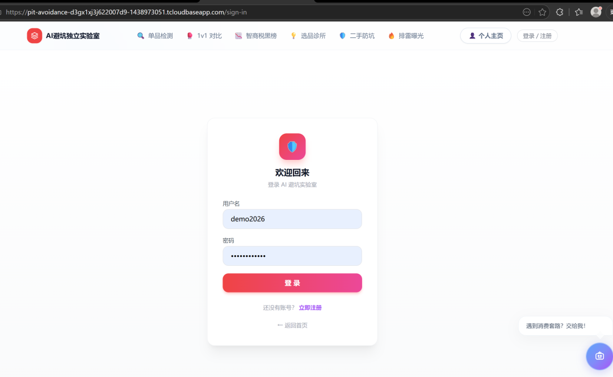

**图 6-1：用户登录页面（/sign-in）**
- 自建认证系统，用户名 + 密码登录，密码经 SHA-256 哈希加密存储
- 支持跳转注册页，右下角 AI 小探员悬浮球全局可用

### 6.2 首页与搜索功能

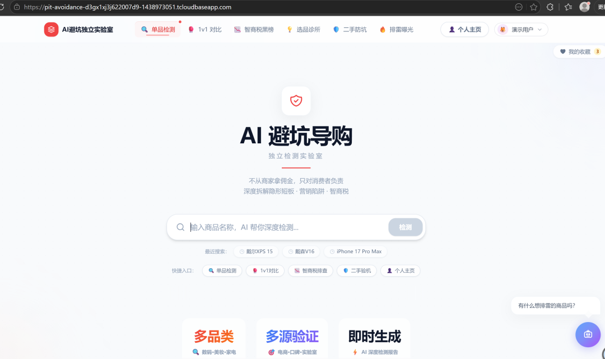

**图 6-2：首页（/）**
- 顶部导航栏覆盖全部功能模块（单品检测、1v1 对比、智商税黑榜、选品诊所、二手防坑、排雷曝光）
- 中央醒目搜索框，输入商品名触发 DeepSeek AI 分析；下方展示热门商品快捷入口与功能入口标签
- 三大特色亮点标签：「多品类」「多源验证」「即时生成」直观传达核心价值

### 6.3 单品检测报告——概览区

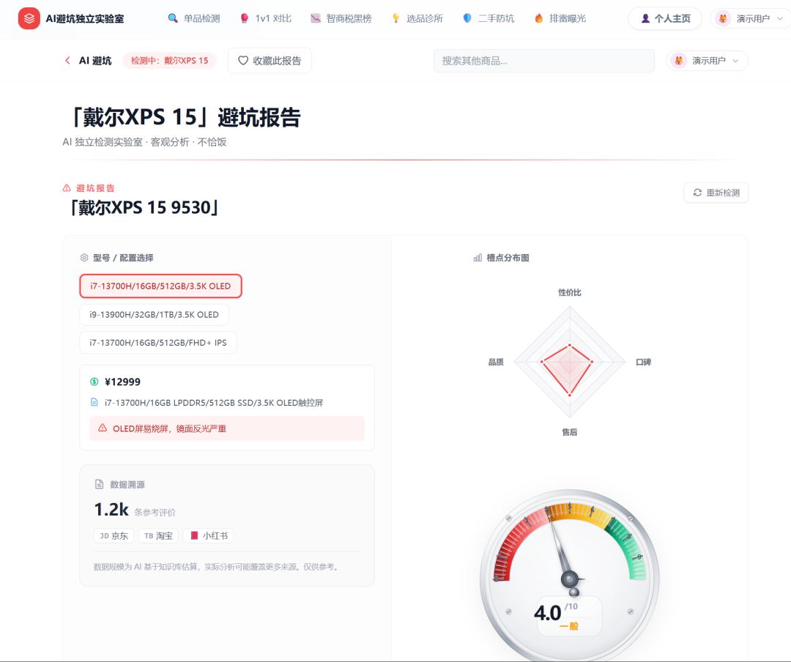

**图 6-3：单品检测报告页——概览区（/report）**
- 左侧：型号/配置推荐列表（含价格标签）、核心槽点预警（红色高亮）
- 右上：ECharts 槽点分布雷达图（性价比/品质/口碑/售后四维）
- 右下：ECharts 风险仪表盘（0-10 分评分 + 等级标注）
- 底部：数据溯源面板（参考评价总数 1.2k + 来源平台标签：京东/淘宝/小红书等）

### 6.4 单品检测报告——分享海报

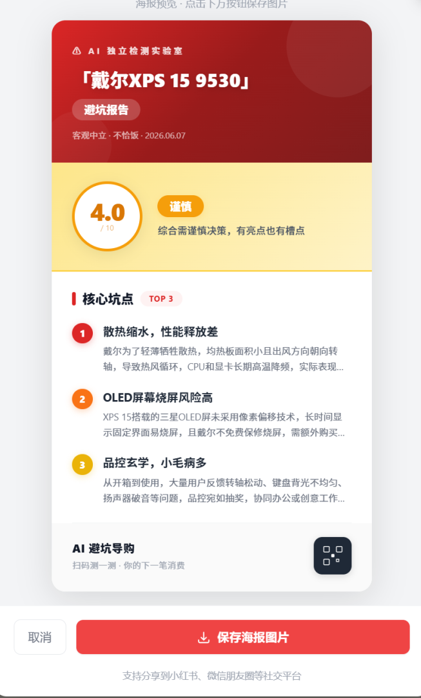

**图 6-4：避坑报告分享海报**
- html2canvas 一键生成 PNG 海报，包含产品名称、综合评分、等级评定、核心坑点 TOP 3
- 支持分享到小红书、微信朋友圈等社交平台

### 6.5 单品检测报告——参数透视 & 槽点详情

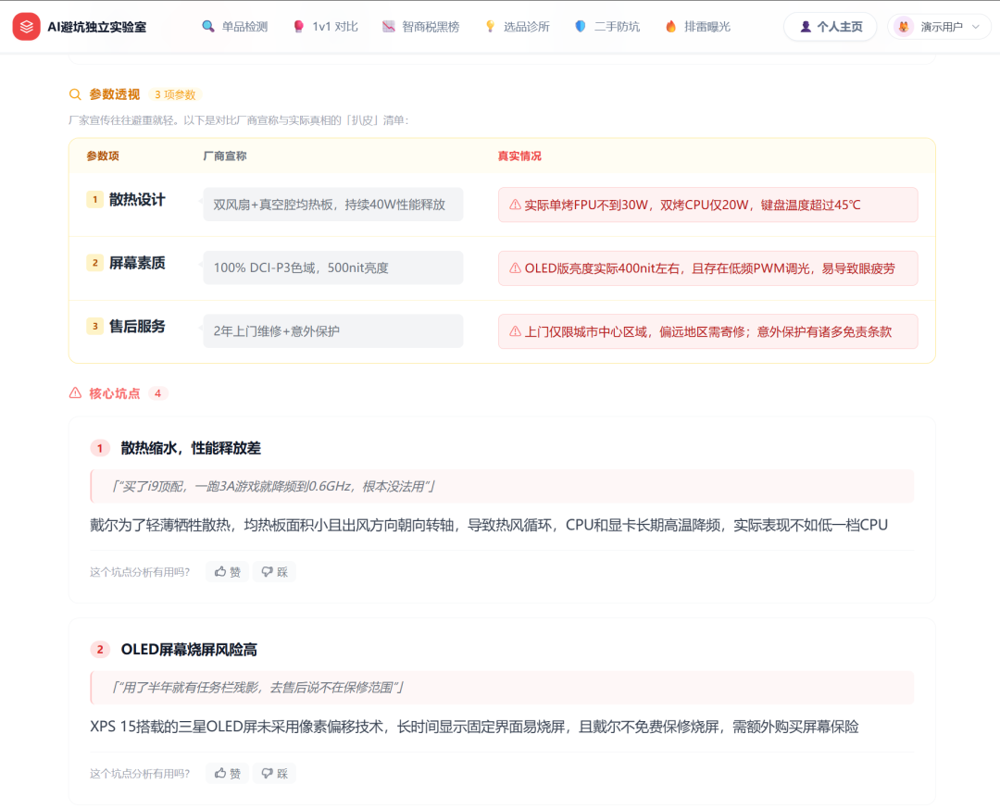

**图 6-5：参数透视表 + 核心槽点详情**
- **参数透视表**：三列对比（参数项 / 厂商宣称 / 真实情况），红色警告标记厂商虚假宣传点（如散热设计、屏幕素质、售后服务）
- **核心槽点列表**：每条槽点含用户原文引用（灰色引用块）+ AI 深度分析 + 赞/踩互动按钮

### 6.6 单品检测报告——替代品推荐 & 多平台验证

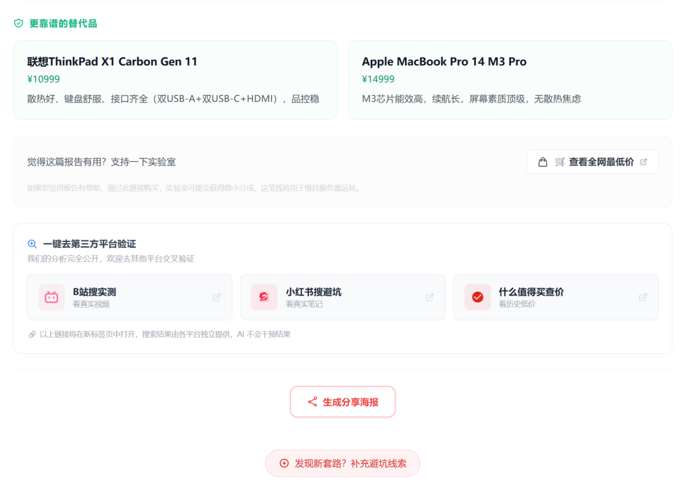

**图 6-6：更靠谱的替代品 + 第三方平台交叉验证**
- 替代品卡片展示推荐理由、价格、优缺点摘要
- 「一键去第三方平台验证」区域提供 B 站搜实测、小红书搜避坑、什么值得买查价三个外链跳转
- 底部「生成分享海报」按钮和「发现新套路？补充避坑线索」入口

### 6.7 小红书/B 站搜索验证


**图 6-7：B 站搜索验证（点击"B 站搜实测"后跳转）**
- 自动打开 B 站搜索对应商品关键词，用户可查看真实 UP 主测评视频进行交叉验证

### 6.8 1v1 商品对比

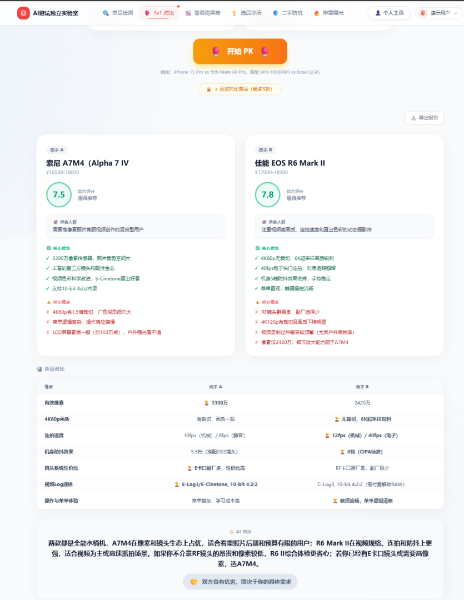

**图 6-8：1v1 商品对比页（/compare）**
- 左右双栏并列展示两商品的评分、优缺点、核心槽点、购买建议
- 中间「胜率对比」表格逐项对比关键指标（有效像素、4K60p 画幅、连拍速度等）
- 底部 AI 综合判决文字 + 双方各有优劣的客观总结

### 6.9 智商税黑榜

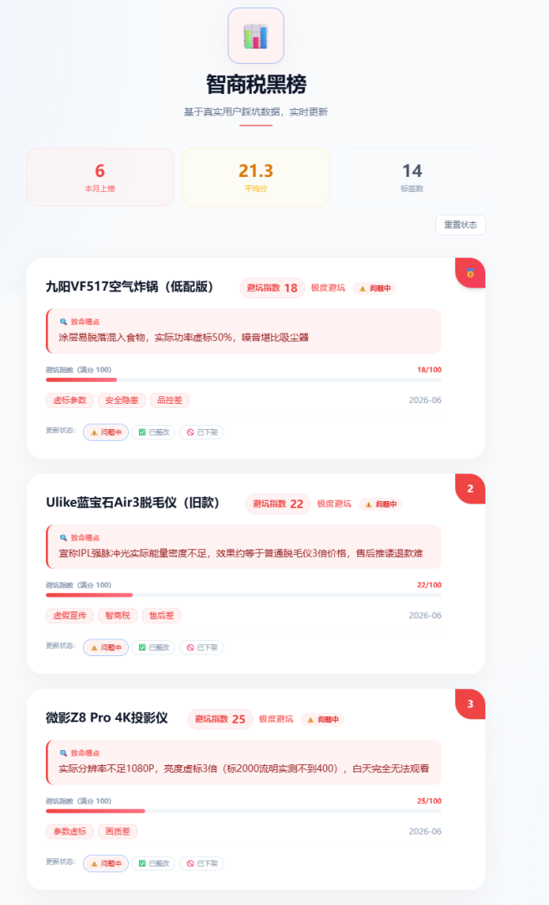

**图 6-9：智商税黑榜页（/blacklist）**
- 顶部统计面板：本月上榜数、平均坑指数、总标签数
- 卡片式展示曝光产品，每张卡片包含避坑理由摘要、避坑指数/极差评级/风险等级标签
- 舆情趋势条形图可视化负面评价占比，底部支持点赞/已踩/已下架互动操作

### 6.10 AI 选品诊所

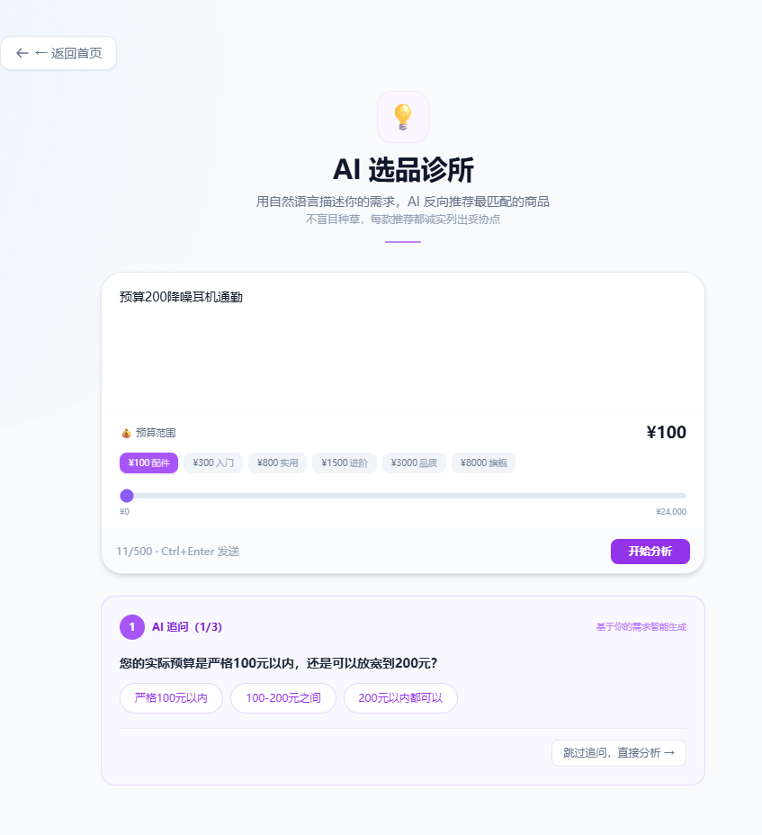

**图 6-10：AI 选品诊所——需求输入页（/clinic）**
- 自然语言描述选购需求，支持预算滑块（¥100 ~ ¥24,000）和预算区间快捷标签
- AI 追问交互（1/3 轮），引导用户明确需求后再生成推荐方案

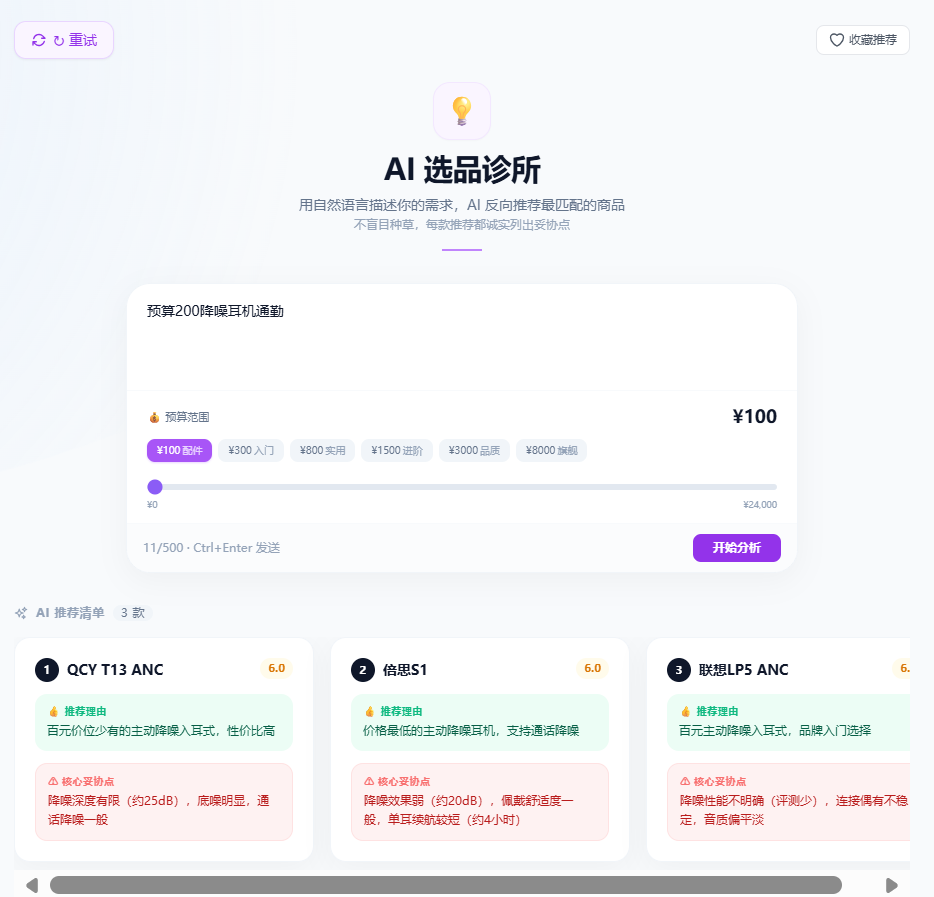

**图 6-11：AI 选品诊所——推荐结果页**
- AI 推荐 3 款最匹配商品，每款含评分、推荐理由（绿色）、协助/坑点（橙色）
- 卡片式布局，横向滚动浏览，右侧可收藏整组推荐

### 6.11 二手防坑鉴定

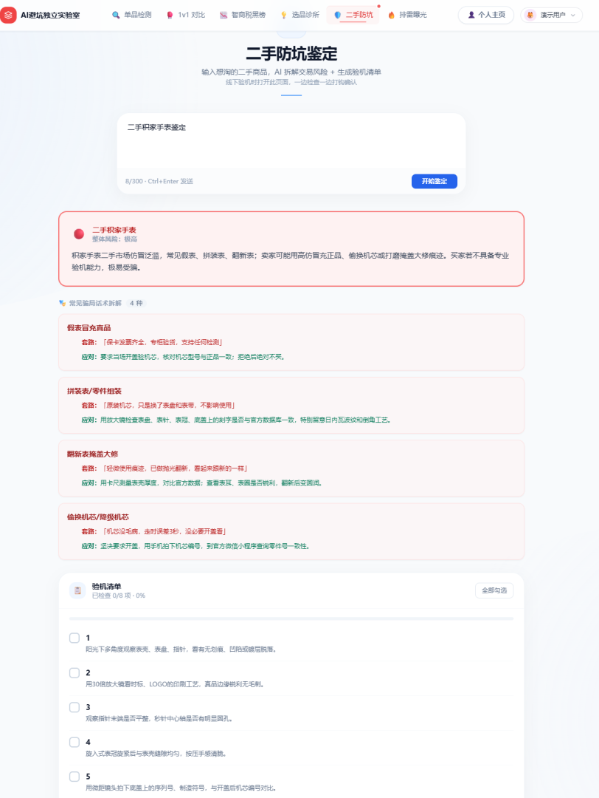

**图 6-12：二手防坑鉴定页（/used-check）**
- 输入二手商品名称 → AI 生成骗局话术拆解（真假对比：套路 vs 对策）
- 常见骗局类型自动识别（假表包真货、拼装/零件组装、翻新换盖大修、偷换机芯/模拟机芯）
- 下方验机清单（带勾选 checkbox），涵盖外观/屏幕/电池/摄像头/接口/网络/恢复出厂等 8 大检测项

### 6.12 排雷曝光社区

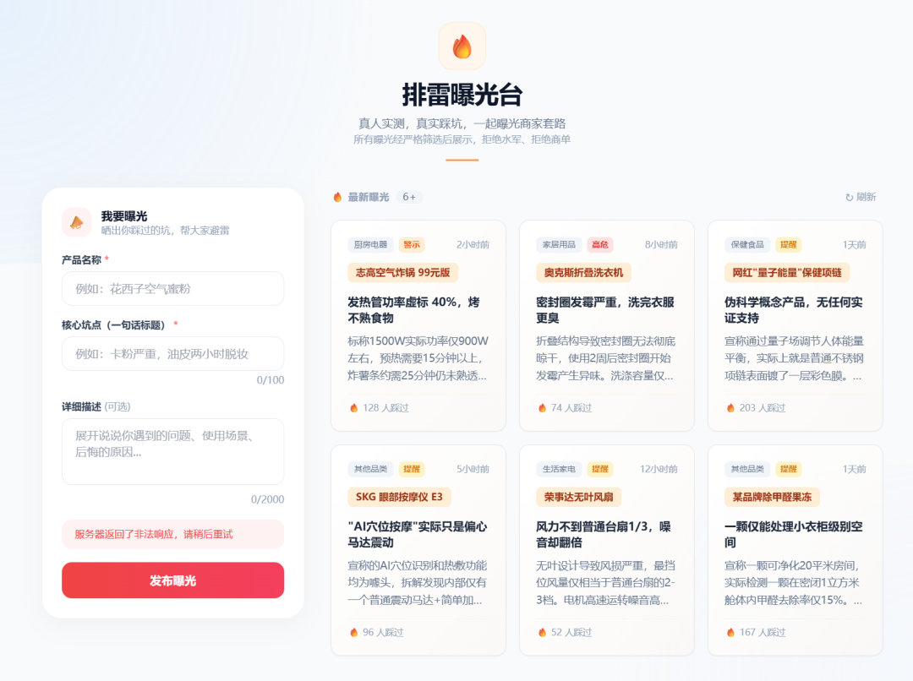

**图 6-13：排雷曝光社区页（/expose）**
- 左侧提交表单：产品名称、核心坑点、详细描述
- 右侧社区警示卡片墙：按时间倒序展示用户提交的曝光内容，含分类标签（数码电器/家居用品/保健食品/网红产品）、避坑指数、阅读人数
- 所有曝光经审核后公开展示，形成社区共享避坑知识库

### 6.13 个人中心

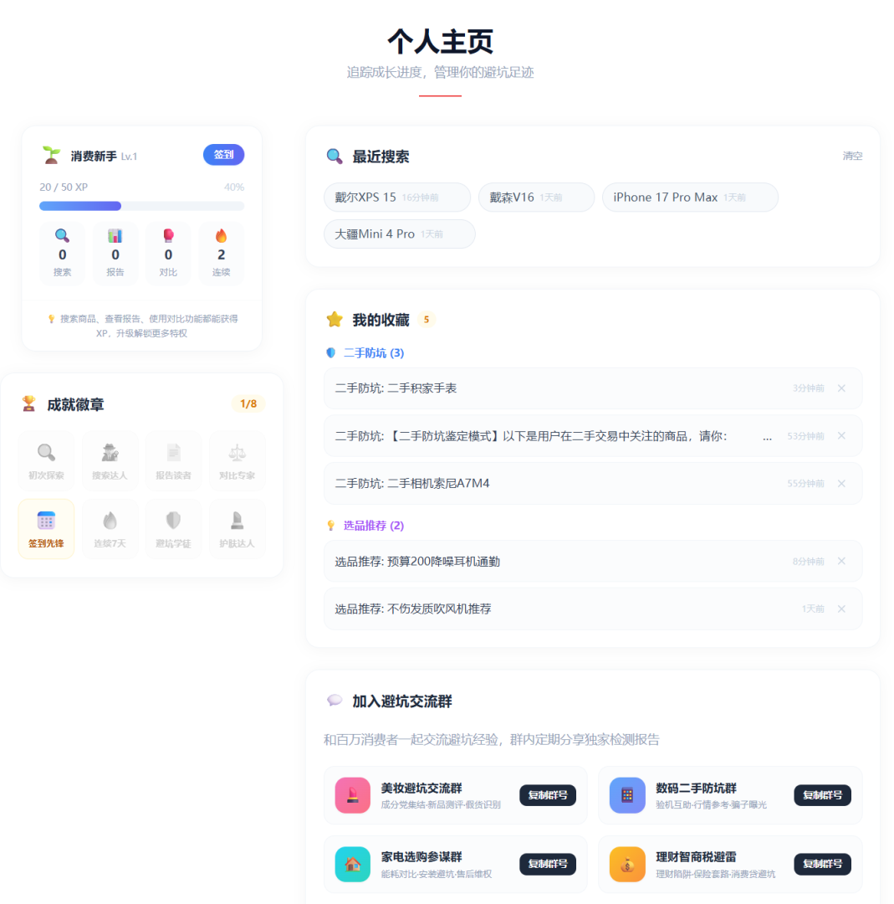

**图 6-14：个人主页（/profile）**
- 左侧：用户等级卡片（Lv.1 消费新手）+ XP 进度条 + 成就徽章墙（签到/连续/避坑字鉴/护联达人共 8 枚）
- 右上方：最近搜索历史标签
- 右中：我的收藏列表（二手防坑/选品推荐分类，支持详情弹窗查看）
- 右下：加入避坑交流群二维码入口（美妆/数码/家电/理财四群）

### 6.14 收藏详情弹窗——选品推荐方案

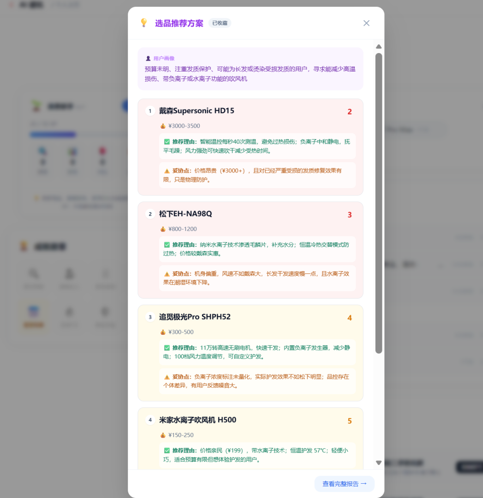

**图 6-15：选品推荐方案收藏详情弹窗**
- 展示完整 AI 推荐清单（4 款商品），每款含价格区间、推荐理、协助点说明
- 支持滚动浏览全量内容，底部「查看完整报告」跳转到独立报告页

### 6.15 收藏详情弹窗——二手防坑鉴定报告

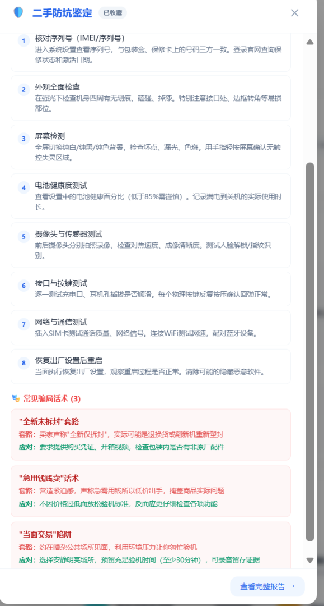

**图 6-16：二手防坑鉴定报告收藏详情弹窗**
- 完整验机步骤清单（8 项：核对序列号→外观检查→屏幕检测→电池健康→摄像头测试→接口按键→网络通信→恢复出厂）
- 常见骗局话术拆解（3 条）：全新未拆封套路、急用钱贱卖话术、当面交易陷阱，每条含套路描述（红）+ 应对策略（绿）

### 6.16 AI 小探员（全局聊天助手）

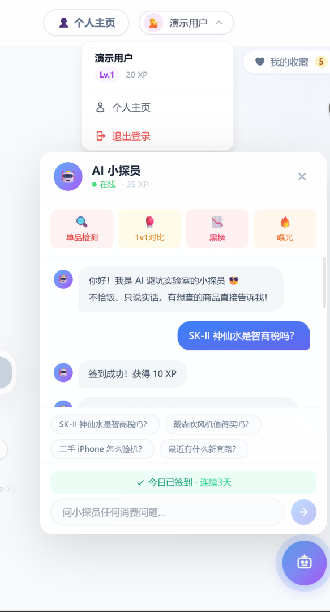

**图 6-17：AI 小探员聊天窗口**
- 右下角悬浮球展开的全局聊天助手，显示在线状态和 XP 等级
- 四个快捷功能按钮：单品检测 / 1v1 对比 / 黑榜 / 曝光
- 对话式消费咨询，支持签到奖励 XP（+10 XP），显示连续签到天数
- 建议气泡引导用户提问（SK-II 是否智商税？戴森吹风机值得买？等）

---

## 七、项目测试与问题解决

### 7.1 功能测试

| 测试项 | 测试方法 | 结果 |
|---|---|---|
| 首页搜索功能 | 输入"戴森吸尘器"验证 AI 分析 | ✅ 返回完整报告 |
| 用户注册登录 | 新用户注册 → 登录 → 查看个人中心 | ✅ SHA-256 加密正常 |
| 收藏同步 | 登录后收藏报告 → 切换标签页验证 | ✅ localStorage 即时 + CloudBase 异步 |
| 管理后台 | 管理员查看/删除用户 | ✅ CloudBase 查询正常 |
| CloudBase 降级 | 断开网络 → 操作收藏/搜索历史 | ✅ 自动降级，功能不受影响 |
| 移动端适配 | Chrome DevTools 模拟手机/平板 | ✅ 响应式布局正常 |

### 7.2 开发问题与解决方案

**问题 1：DeepSeek API 响应超时导致前端报错**

- **现象：** 复杂商品分析请求时，DeepSeek API 响应时间超过默认 30s 超时限制，同时多平台评论信息综合分析进一步增加了推理耗时，前端捕获到超时错误后无兜底展示。
- **解决方案：** 将云函数中 DeepSeek API 的 timeout 从 30s 增至 45s，并添加 2 次自动重试机制（第 1 次失败后等待 2s 重试，第 2 次失败后等待 5s 再试）。即使三次请求全部失败，云函数内置的 `generateFallback()` 会生成包含通用避坑提示的兜底 JSON，前端层增加 loading 状态动画，30s 以上时展示"AI 正在深入分析，请耐心等待"提示文案。最终所有异常路径都有文案兜底，用户不会遇到白屏。

**问题 2：多平台评论数据分散，无法直接获取结构化分析**

- **现象：** 京东、淘宝、小红书、B站等多个电商和内容平台的评论数据均为非结构化文本，且各平台反爬机制不同，直接爬取成本高、稳定性差。
- **解决方案：** 采用 DeepSeek API 作为间接数据聚合层——DeepSeek 的训练数据已涵盖上述多平台的海量评论信息，通过精心设计的 System Prompt（包含 5 种 Intent 路由 + 详细输出 Schema），引导 DeepSeek 在生成分析结果时综合多平台信息，输出结构化的 JSON 避坑方案报告。价格数据则双重保障：优先通过慢慢买 API 实时抓取京东/苏宁报价，失败时自动降级到 DeepSeek 知识库估算。这种"AI 推断 + API 抓取 + 降级兜底"的三层策略，在不直接爬取各平台的前提下实现了多源数据聚合。

**问题 3：CloudBase NoSQL 初始化失败导致页面白屏**

- **现象：** 在网络不稳定或 CloudBase 服务波动时，`getDb()` 返回 null，后续数据库操作报错导致页面崩渍。
- **解决方案：** 在所有数据库操作函数中添加 null 检查和 try-catch，当 CloudBase 不可用时静默降级到 localStorage 模式，并在控制台输出 warning 日志。封装统一的 `getDb()` 方法，返回 null 时上层逻辑自动跳过同步步骤。

---

## 八、项目总结与心得

### 8.1 项目总结

本项目成功实现了一个功能完整的 AI 驱动消费决策辅助系统，覆盖了从多平台评论聚合分析、DeepSeek AI 方案报告生成、数据可视化到用户认证、数据同步的完整功能链条。项目亮点包括：

- **技术完整性：** 前端 11 个页面 + 30 个组件 + 自建认证体系 + 8 级 XP 系统，后端 2 个云函数（aiSearch + registerUser），数据库 3 张 NoSQL 集合，接口层对接 DeepSeek API + 慢慢买价格 API + 京东联盟 API + 淘宝客 API + CloudBase SDK 等多类外部服务
- **多平台数据聚合：** 通过 DeepSeek API 间接聚合京东/淘宝/天猫/拼多多/苏宁/抖音/小红书/B站/知乎/什么值得买等 10+ 个平台的用户评论信息，配合慢慢买 API 实时价格抓取 + 知识库估算的双源比价，实现对分散评论数据的智能整合
- **架构合理性：** 全静态前端 + 云函数后端的分离架构，CDN 全球加速，零独立服务器成本，前端 → 云函数 → DeepSeek 双层调用链有效屏蔽 API 密钥
- **四级容错降级设计：** ① DeepSeek API 失败 → 2 次重试 → 兜底 JSON → 前端兜底文案 ② 慢慢买价格 API 失败 → 降级到 DeepSeek 知识库估算 ③ CloudBase NoSQL 不可用 → 静默降级到 localStorage ④ 全局 ErrorBoundary 兜底，任何异常不导致白屏

存在的不足与优化方向：
- 目前 AI 分析质量依赖 DeepSeek 模型能力，建议增加结果缓存减少重复 API 调用
- 多平台评论数据目前通过 DeepSeek API 间接聚合，评论的时效性和覆盖率受模型训练数据截止日期限制
- 价格抓取的慢慢买 API 有调用频率限制，高并发下可能触发降级，已通过接入京东联盟/淘宝客 API 作为电商跳转佣金追踪的补充方案
- 移动端体验可进一步优化，如增加 PWA 离线支持

### 8.2 学习心得

通过本次大数据案例应用开发，我收获了以下几方面的成长：

1. **全栈开发能力：** 从零搭建 Next.js + TypeScript + CloudBase 全栈项目，掌握了前端框架、后端云函数、NoSQL 数据库的完整开发流程
2. **LLM 应用集成与 Prompt 工程：** 深入学习了如何将大语言模型（DeepSeek）集成到实际业务中——包括设计 5 种 Intent 路由的 System Prompt、通过 Zod Schema 校验结构化 JSON 输出、超时重试与多级降级容错策略，理解了"用 AI 间接聚合多平台数据"这一不依赖直接爬取的替代方案
3. **架构设计与容错思维：** 理解了"本地优先 + 云端同步"混合存储架构的设计理念，掌握了四级降级策略（DeepSeek 重试→兜底 JSON→前端文案→ErrorBoundary），体会到容错设计在前后端全链路中的重要性
4. **多平台 API 对接经验：** 实践了同时对接多个平台 API 的技术集成——DeepSeek AI API（核心分析引擎，45s 超时 + 2 次重试）、慢慢买价格 API（京东/苏宁实时价格抓取，失败自动降级）、京东联盟 API + 淘宝客 API（商品购买跳转与佣金归因，`CommerceBanner` 组件通过 `affiliateUrl` 透传）以及 CloudBase SDK（NoSQL 数据库读写）——涵盖 API 密钥隔离（前端不暴露）、多源数据互补（实时抓取 + AI 估算 + 联盟佣金追踪）和失败降级调度
5. **数据驱动开发：** 学会了利用公开大数据集（CPSC 产品召回 9,350 条、虚假评论标注 1,600 条）为产品提供客观数据背书，通过预处理 CSV → JSON + 组件直接 import 的方式实现零延迟的静态数据可视化，掌握在静态导出环境下优雅处理数据引用和交叉验证的模式
6. **工程化实践：** 深入使用 Git 版本管理、AI 辅助开发工具（CodeBuddy）、云服务部署等现代开发工作流，完成了从需求分析到线上部署的完整闭环

---

## 九、参考文献

- [1] Next.js 官方文档 - https://nextjs.org/docs
- [2] React 官方文档 - https://react.dev/
- [3] Tailwind CSS 文档 - https://tailwindcss.com/docs
- [4] DeepSeek API 文档 - https://platform.deepseek.com/api-docs
- [5] 腾讯云 CloudBase 开发文档 - https://docs.cloudbase.net/
- [6] ECharts 官方文档 - https://echarts.apache.org/
- [7] Zod 官方文档 - https://zod.dev/
- [8] CPSC 产品召回数据集 - https://www.cpsc.gov/Recalls
- [9] Deceptive Opinion Spam Corpus - https://myleott.com/op_spam/
- [10] TypeScript 官方手册 - https://www.typescriptlang.org/docs/

---

## 十、提交要素自查清单（最终核对）

| 编号 | 检查项 | 状态 |
|---|---|---|
| ✅ | 项目源码完整齐全，无文件缺失、无报错，可正常启动运行 | 通过 |
| ✅ | 项目报告所有模块已完整填写，内容贴合个人开发项目 | 通过 |
| ✅ | 结课项目报告.md、.env.example 等配套说明内容齐全 | 通过 |
| ✅ | 项目运行截图核心功能展示清晰、图文对应 | 通过 |
| ✅ | 核心代码解析、问题与解决方案内容真实具体，无空项 | 通过 |
| ✅ | 整体项目功能完整，达到课程期末项目考核要求 | 通过 |

---

*👩‍💻 作者：王倩 📅 日期：2026 年 6 月 🎓 大数据案例期末项目 · 全栈独立开发*
